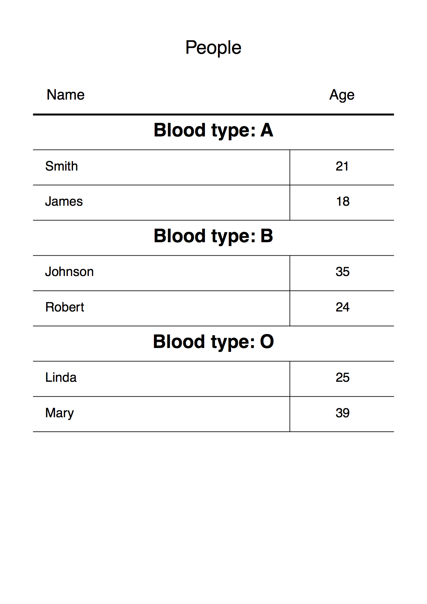

# Group List Rows - Thinreports Examples

## How to run

Bundle in this directory:

    % bundle install

And execute `group_rows.rb`:

    % bundle exec ruby group_rows.rb

`result.pdf` will be created.

## Requirements

* ruby >= 1.9.3
* thinreports 0.9.0
